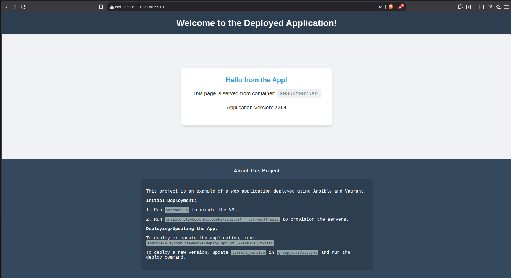

# Ansible Production-Grade Local Environment

This project creates a complete, production-style local environment using Vagrant and Ansible. It simulates a real-world setup with a load balancer and multiple web servers running a Dockerized application, and demonstrates best practices like zero-downtime rolling updates and automatic rollbacks.

## Architecture

The environment consists of three virtual machines:
-   `lb1`: An Nginx load balancer (`192.168.56.10`)
-   `web1`: A web server running a Dockerized Flask app (`192.168.56.11`)
-   `web2`: A web server running a Dockerized Flask app (`192.168.56.12`)

## Prerequisites

-   [Vagrant](https://www.vagrantup.com/downloads)
-   [VirtualBox](https://www.virtualbox.org/wiki/Downloads)
-   [Ansible](https://docs.ansible.com/ansible/latest/installation_guide/intro_installation.html)

## How to Run the Project

### 1. Initial Setup (Provision VMs)

First, bring up the virtual machines using Vagrant.

```bash
vagrant up
```
This will create and configure the three VMs as defined in the `Vagrantfile`.

### 2. Encrypt Secrets

The `group_vars/vault.yml` file contains sensitive data. Encrypt it using Ansible Vault. You will be prompted to create a password. You will need to provide this password when running playbooks that use these secrets.

```bash
ansible-vault encrypt group_vars/vault.yml
```

### 3. Run the Site Provisioning Playbook

Next, run the main `site.yml` playbook to provision all the servers. This will install common packages, Docker, Nginx, and configure the system.

```bash
# --ask-vault-pass will prompt for the password you created in the previous step
ansible-playbook playbooks/site.yml --ask-vault-pass
```

### 4. Perform the First Deployment

Deploy the application for the first time using the `deploy_app.yml` playbook. This will build the Docker image and start the application on both web servers.

```bash
ansible-playbook playbooks/deploy_app.yml --ask-vault-pass
```

After this step, you can access the application through the load balancer's IP address in your browser: `http://192.168.56.10`. Refresh the page a few times to see the load balancer distribute traffic between `web1` and `web2`.

### 5. Perform a Rolling Update

To deploy a new version of the application without downtime, use the `rolling_update.yml` playbook. It will update one server at a time and perform a health check before continuing.

You will be prompted to enter the new version number.

```bash
ansible-playbook playbooks/rolling_update.yml --ask-vault-pass
```
The playbook will automatically handle setting the `previous_version` and `current_version` variables.

If the deployment fails on a node for any reason (e.g., the health check fails), it will automatically trigger the `rollback` role on that node to revert to the last known good version.

### 6. Perform a Manual Rollback

If you need to manually revert the entire web server fleet to the previous version, you can run the `rollback.yml` playbook.

```bash
ansible-playbook playbooks/rollback.yml --ask-vault-pass
```

This project provides a solid foundation for building a robust, automated infrastructure using Ansible, following modern CI/CD and DevOps practices.
# ansible_project
